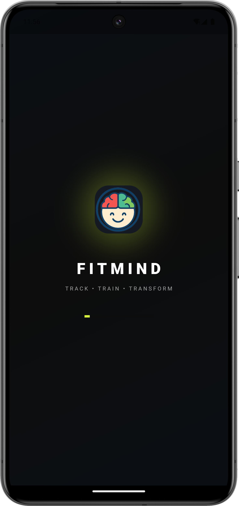
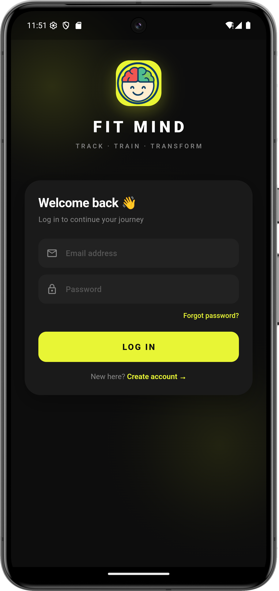
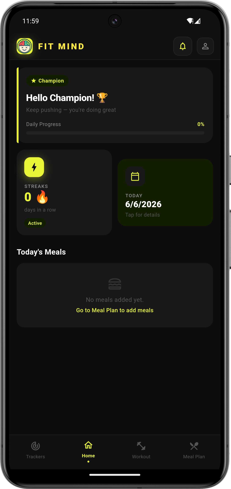
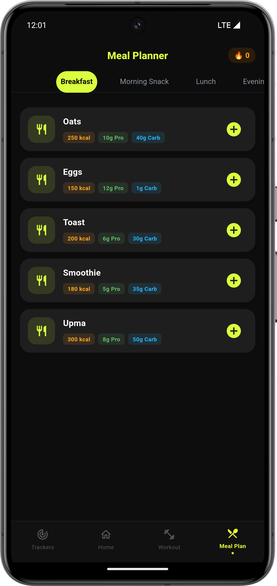
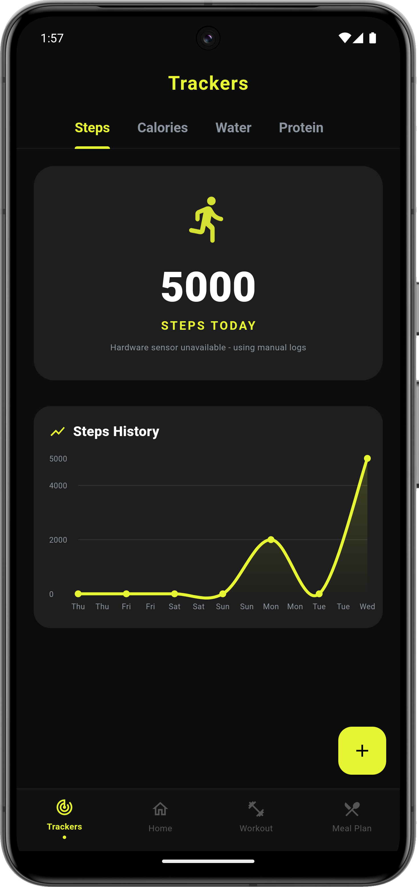

# FitMind

<p align="center">
  
</p>

<p align="center">
  <strong>Personal Fitness & Nutrition Tracker</strong>
</p>

<p align="center">
A modern Flutter application that helps users monitor workouts, nutrition, hydration, fitness progress, and daily habits through an intuitive and engaging user experience.
</p>

<p align="center">
  
  
  
  
</p>

---

## Overview

FitMind is a fitness and wellness management application developed using Flutter and Dart. The application enables users to track their daily activities, workout routines, meal plans, hydration levels, and overall fitness progress from a centralized dashboard.

The project focuses on delivering a clean user experience while encouraging consistency through progress tracking, streak systems, reminders, and personalized fitness insights.

---

## Key Highlights

* Modern dark-themed user interface
* Daily fitness progress monitoring
* Workout planning and management
* Nutrition and meal tracking
* Water intake monitoring
* Activity and step tracking
* Streak and achievement system
* Notification center
* User profile management
* Scalable Flutter architecture

---

## Features

### Dashboard

The dashboard provides a centralized overview of daily fitness activities and performance metrics.

**Capabilities**

* Daily progress tracking
* Activity summary
* Fitness streak visualization
* Quick navigation to core features
* Motivational insights

---

### Workout Management

Users can explore and follow structured workout plans designed for different fitness goals.

**Available Programs**

* Home Workout
* Gym Workout
* Fat Loss Program
* Muscle Gain Program
* Abs & Core Training
* Stretching & Mobility
* Beginner Training Program
* Advanced Training Program

**Features**

* Goal-based workouts
* Workout detail pages
* Duration tracking
* Structured exercise plans

---

### Nutrition & Meal Planning

A dedicated meal planning module helps users organize daily nutrition.

**Meal Categories**

* Breakfast
* Morning Snack
* Lunch
* Evening Snack
* Dinner

**Features**

* Add meals
* Remove meals
* Nutrition overview
* Daily meal schedule
* Dietary organization

---

### Fitness Tracking

FitMind enables users to monitor important health metrics.

**Trackers Included**

* Step Counter
* Water Intake
* Calories Burned
* Weight Monitoring
* Workout Duration

---

### Notifications

The notification system improves user consistency and engagement.

**Supported Notifications**

* Workout reminders
* Hydration reminders
* Meal reminders
* Achievement alerts
* Streak milestones
* Fitness recommendations

---

### Streak System

The streak system motivates users to maintain healthy habits over time.

**Milestones**

* 50 Days
* 100 Days
* 200 Days
* 365 Days

---

### Profile Management

Users can personalize and manage their fitness experience.

**Features**

* Edit profile
* Manage personal information
* Personalized experience

---

## User Interface

FitMind follows a modern and minimal design philosophy focused on usability and readability.

| Element    | Color   |
| ---------- | ------- |
| Background | #0D0D0D |
| Surface    | #181818 |
| Accent     | #E8F535 |
| Text       | #FFFFFF |

---

## Technology Stack

### Frontend

* Flutter
* Dart

### State Management

* ValueNotifier
* ValueListenableBuilder

### Design System

* Material Design 3
* Custom Dark Theme

---

## Project Structure

```text
lib/
│
├── main.dart
├── splash_screen.dart
├── intro_screen.dart
├── login_screen.dart
│
├── student_dashboard.dart
├── profile_screen.dart
├── edit_profile_screen.dart
│
├── trackers_screen.dart
├── meal_plan_screen.dart
├── notifications_screen.dart
│
├── workout_plans_screen.dart
├── workout_detail_screen.dart
│
└── data_store.dart
```

---

## Installation

### Clone Repository

```bash
git clone https://github.com/jainam258/FitMind.git
```

### Navigate to Project

```bash
cd FitMind
```

### Install Dependencies

```bash
flutter pub get
```

### Run Application

```bash
flutter run
```

---

## Application Screenshots

> Add your screenshots below.

### Authentication & Onboarding

| Splash Screen                    | Login Screen                     |
| -------------------------------- | -------------------------------- |
|  |  |

### Main Application

| Dashboard                 | Workout Plans                        | Workout Details                            |
| ------------------------- | ------------------------------------ | ------------------------------------------ |
|  |  |  |

### Fitness & Tracking

| Meal Planner                  | Trackers                      | Notifications                               |
| ----------------------------- | ----------------------------- | ------------------------------------------- |
|  |  |  |

---

## Future Roadmap

Planned enhancements include:

* Firebase Authentication
* Cloud Data Synchronization
* AI Workout Recommendations
* AI Nutrition Suggestions
* BMI Calculator
* Sleep Tracking
* Google Fit Integration
* Advanced Analytics Dashboard
* Progress Charts
* Social Challenges
* Push Notifications
* Custom Workout Builder

---

## Contributing

Contributions, suggestions, and improvements are welcome.

1. Fork the repository
2. Create a feature branch
3. Commit your changes
4. Push the branch
5. Open a Pull Request

---

## Developer

**Jainam Shah**

Computer Engineering Student

Flutter Developer | Mobile Application Developer | UI/UX Enthusiast

GitHub: https://github.com/jainam258

---

## License

This project is intended for educational and portfolio purposes.

---

## Support

If you find this project useful, consider starring the repository to support future development.

---

### FitMind

**Track Better. Train Smarter. Live Healthier.**
